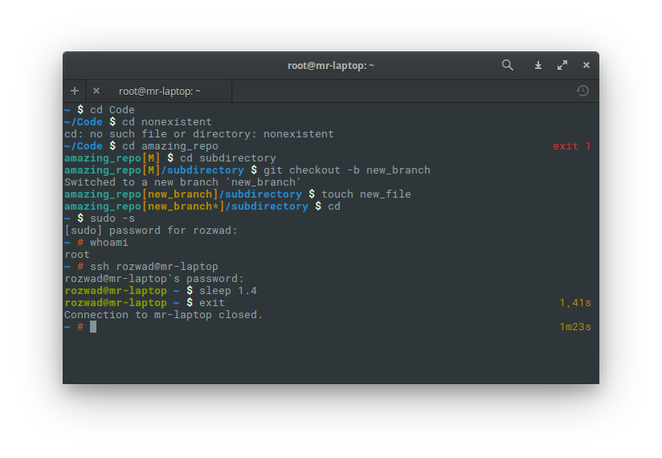

# My custom ZSH theme
On top of [oh-my-zsh](https://github.com/robbyrussell/oh-my-zsh), I've created an informative ZSH prompt that fits my needs
and hopefully you'll also find it useful.

## Screenshot


## Features
* fits in a single line
* displays user@hostname only if connected via SSH
* when in a Git repo, displays:
  * name of the repository,
  * branch name; master is abbreviated to M,
  * asterisk to indicate if there are uncommitted changes,
  * current path relative to the repository root
* shows a dollar sign for a standard user or a red hash when running with privileges
* if the last command failed, its status is shown on the right hand side
* if the last command took a long time to execute, its duration is also shown on the right
  * with two decimal places if less than a minute
  * as hours, minutes and seconds if longer

## Installation
If you haven't, go to [ohmyz.sh](http://ohmyz.sh/) to install oh-my-zsh.
Then execute the following commands in your terminal:

```zsh
mkdir -p $ZSH_CUSTOM/themes # create a directory for custom themes if it doesn't exist
wget -P $ZSH_CUSTOM/themes https://raw.githubusercontent.com/hejmsdz/myzsh/master/mikolaj.zsh-theme
sed -i 's/^ZSH_THEME=.*$/ZSH_THEME=mikolaj/' ~/.zshrc # change the theme in your config file, you may as well use an editor to update it
```

Finally, reopen your terminal.

## Contributing
Issues, forks and pull requests are welcome.
